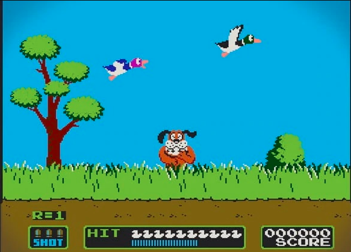

# Android con Juegos 2d con Firebase

## Descripcion 

Curso tomado en la platafoma udemy 11 hrs

https://www.udemy.com/course/android-juegos-2d-desde-cero/

Aprende Java y Android desde 0 para juegos 2D con Android Studio + animaciones, gráficos, multiplayer online, rankings.
DuckHund y Gato(Tick Tac To)

El curso es impartido por Alejandro Lora y Miguel Campos Rivera

## Galeria

## Lo que se aprendera 

- Desarrollo de juegos 2D en Android
- Conexión de apps con Google Firebase
- Programación Java para Android
- Desarrollo de aplicaciones Android
- Conexión a base de datos en la nube
- Conexión en tiempo real a base de datos y dispositivos Android